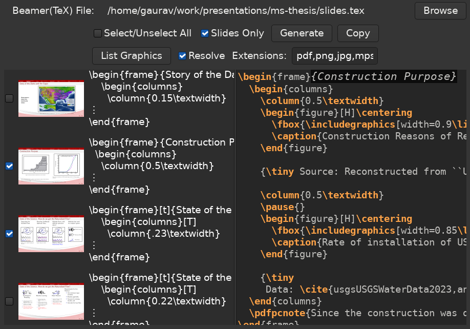

# Beamer Quickie

Quickly open a beamer presentation file (.tex) and copy some slides.

Provides TeX codes to copy, as well as scans the text for any graphics files you might have to copy to the new location.

# Introduction
This is a really simple app that I made to learn GTK in rust. 

The concept is to open LaTeX Beamer files, and see the corresponding pages from the compiled PDF along with your code, so that you can copy some slides from there without having to search the text manually.

The frame images are loaded from PDF of the same name as the LaTeX file (if present). if SyncTeX file is present, the pages will be accurate (as long as there is only one source TeX file), if SyncTeX is not present, the app will try to guess the pages for the frames (won't work if you have frames with `allowbreaks`, [please don't](https://mirror.mwt.me/ctan/macros/latex/contrib/beamer/doc/beameruserguide.pdf#subsubsection.5.1.3)).

# Screenshot

# Usage

Use `Generate` button to generate the selected slides' text into the Editor, and then use `Copy` button to copy it (you can edit there if you want befor copying). The syntax highlighting is very basic.

Now paste that to a new file in your favorite editor. You can use the `List Graphics` button after that to generate the list of graphics files you'll have to copy to the new location as well (if your new file is in a different folder).

`Save As` option to LaTeX and `Copy` options for the graphics is not provided as there might be problems associated with absolute paths and relative paths going outside directory.

# Other Features and Non-features
There are many features that could be possible with this. So far my knowledge of the GTK limits a lot of them. Feel free to make issues and maybe pull requests if that feature seems like a good idea.

One thing I wanted to do was save the file, but currently the TeX file's contents are read only for the `frame` environment, so anything between the frames is lost. Like `\section` and other environment info. Hence I didn't add a save button that might make you lose contents on the file.

The `List Graphics` currently lists the graphics by finding the `\includegraphics` command arguments and then searching for those files in directories in `\graphicspath` command (and the parent dir of TeX file). You can use that to copy graphics for a new project. But since LaTeX allows you to not have to write the extension of the files, there is a field where you can give your lists of extensions to try if the `\includegraphics` command argument has none. The extensions here should be the same order of extension as the one in your `\DeclareGraphicsExtensions` command (the default value is provided).
